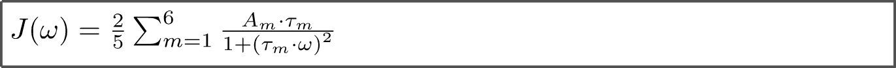

<div align="justify">

# Calculation of 15N relaxation rates from MD trajectory

### Theoretical notes

The processing of the MD trajectory of the NCP particle includes the following steps:

1) overlay all MD frames by superimposing them onto the reference coordinates 3lz0 via the secondary-structure Cα atoms
   from the histone core. At this step, we assemble the nucleosome particle that may appear split over boundaries under
   periodic boundary condition through the MD trajectory. In addition, we eliminate the artifact of the overall tumbling
   of the NCP.


2) extract coordinates of N-H vectors from MD trajectory: N-H vector of i-th residue explores different orientations at
   j-th time step over the MD trajectory. We want to detect the correlation time of this stochastic process.

<p align="center">
  
</p>

3) calculate i-th spherical harmonic Y20 from coordinates of i-th N-H vector at j-th time step (to cover orientational
   dynamics)

<p align="center">
  2
</p>

4) calculate auto-correlation function g(τ). At this step, the overall tumbling was reintroduced by multiplying the
   result by exp(-τ/τ_rot), where τ_rot is 163.4 ns.

<p align="center">
  2
</p>

5) fit auto-correlation function with a 6-exponential function, containing twelve fitting parameters (amplitudes ai and
   characteristic times τi). As an initial approximation, we have used ai = 1/6 and τi uniformly distributed on a
   logarithmic scale between 1 ps and 163.4 ns; prior to the fitting, these values were subjected to a random variation.
   For each correlation function, the fitting was repeated thrice with the randomized initial conditions.


6) translate the obtained ai and τi values into spectral densities

<p align="center">
  2
</p>

8) calculate 15N R1 and R2 relaxation rates. In these calculations, we employed the standard values of the N-HN bond
   length (1.02 Å) and 15N chemical shift anisotropy (-170 ppm).

<p align="center">
  2
</p>

### Run scripts

The scripts for calculation 15N relaxation rates for H4 tails were wrapped into pipeline using make utility. To process
own trajectory, you need to copy analysis template [analysis_template/H4_tails](analysis_template/H4_tails) into your
handling dir and specify the parameters
into [analysis_template/H4_tails/common.mk](analysis_template/H4_tails/common.mk) and than type make.

### Run tests

We provide analysis template to process short 10-ns trajectory recorded with Amber or Gromacs packages. Of note, the
results of processing are only technical and can not be used for interpretation of H4-tail dynamics.

```code-block:: bash
   cd example
   
   # run processing of MD trajectory in the Amber format 
   cd trajectory_AmberNetCDF
   cd H4 
   make
   
   # run processing of MD trajectory in the Gromacs format 
   cd trajectory_GromacsXtc
   cd H4 
   make 
```

</div>
