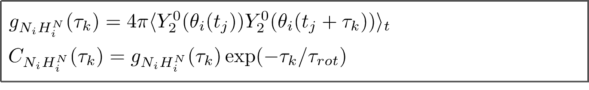

<div align="justify">

# Calculation of 15N relaxation rates from MD trajectory

### Theoretical notes

The processing of the MD trajectory of the NCP particle includes the following steps:

1) overlay all MD frames by superimposing them onto the reference coordinates 3lz0 via the secondary-structure Cα atoms
   from the histone core. At this step, we assemble the nucleosome particle that may appear divided at the boundaries due to
   periodic boundary condition in the MD simulation. In addition, we eliminate the effect of the overall tumbling
   of the NCP.


2) extract coordinates of N-H vectors from the MD trajectory: N-H vector of i-th residue assumes different orientations at
   different time points tj during the MD trajectory. We want to determine the correlation function of this stochastic reorientational process.

<p align="center">
  
</p>

3) for the coordinates of i-th N-H vector, calculate the spherical harmonic Y20 at time points tj

<p align="center">
  
</p>

4) calculate auto-correlation function g(τ). Next, the overall tumbling is reintroduced by multiplying the
   result by exp(-τ/τ_rot), where τ_rot is rotational correlation time of the NCP asssumed to be 163.4 ns.

<p align="center">
  
</p>

5) fit G_NH(τ) with a 6-exponential function, containing twelve fitting parameters (amplitudes ai and
   characteristic times τi). As an initial approximation, we have used Ai = 1/6 and τi uniformly distributed on a
   logarithmic scale between 1 ps and 163.4 ns; prior to the fitting, these values are subjected to a random variation.
   For each correlation function, the fitting is repeated thrice with the randomized initial conditions.
   Comment: using 6-exponential fitting function leads to overfitting; however, this procedure nicely captures the shape of the correlation function
   and recovers the value of spectral density (see below) in a consistent reproducible fashion. 

7) translate the obtained Ai and τi values into spectral densities

<p align="center">
  
</p>

8) calculate 15N R1 and R2 relaxation rates. In these calculations, we employed the standard values of the N-HN bond
   length (1.02 Å) and 15N chemical shift anisotropy (-170 ppm).

<p align="center">
  
</p>

9) To calculate other relaxation observables, such as NOEs or cross-correlated relaxation rates, the algorithm is very similar except
   the final formulas are different and may involve additional parameters.
    
### Run scripts

The scripts for calculation of 15N relaxation rates for H4 tails were assembeled into a pipeline using make utility. To process
your own trajectory, you need to:
1) copy the template [analysis_template/H4_tails](analysis_template/H4_tails)
2) specify the parameters in [analysis_template/H4_tails/common.mk](analysis_template/H4_tails/common.mk)
3) type make.

### Run tests

We provide the templates to analyze short 10-ns trajectories recorded with Amber and Gromacs packages. Of note, the
results are for demonstration purpose only and cannot be used for interpretation of H4 tail dynamics.

```code-block:: bash
   # run the script to process Amber MD trajectory 
   cd example/trajectory_AmberNetCDF/H4_tails 
   make
   
   # run the script to process Gromacs MD trajectory 
   cd example/trajectory_GromacsXtc/H4_tails
   make 
```

</div>
